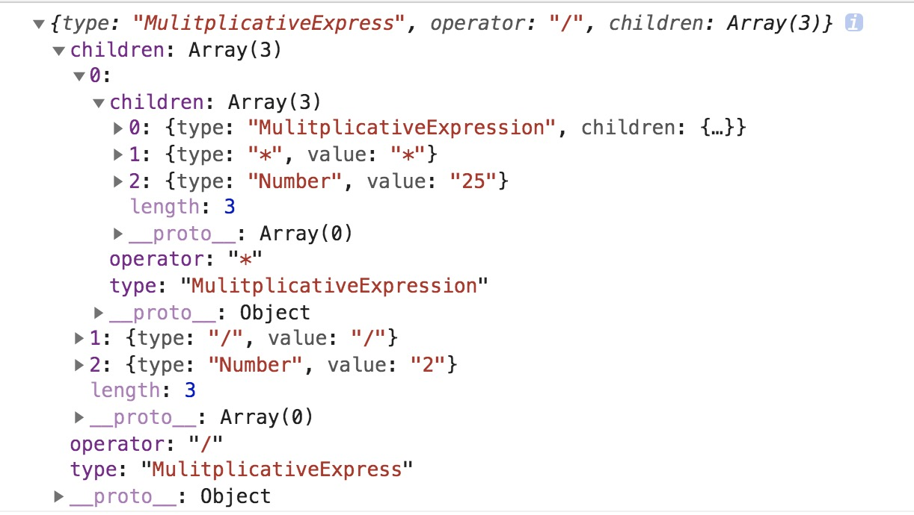

# 学习笔记

## 抽象语法树 - AST(Abstract Syntax Tree)
### 纯文本如何转换成 AST？
**一般来说通常分成两步，词法分析 和 语法分析**

#### 词法分析
读取代码（通常是字符串），按照既定的规则封装成一个有一个对象，最后生成一个tokens列表（一维数组）

下面手动实现词法分析：
```javascript
function* tokenize (code) {
  const regexp = /([0-9\.]+)|([ \t]+)|([\r\n]+)|([\*]+)|([\/]+)|([\+]+)|([\-]+)/g
  const dictionary = ["Number", "Whitespace", "LineTerminator", "*", "/", "+", "-"]
  let result = null, lastIndex = 0
  while (true) {
    lastIndex = regexp.lastIndex
    result = regexp.exec(code)
    if (!result) break
    if (regexp.lastIndex - lastIndex > result[0].length) break

    let token = {
      type: null,
      value: null
    }

    for (let i = 1; i <= dictionary.length; i++) {
      if (result[i]) token.type = dictionary[i-1]
    }
    token.value = result[0]

    yield token
  }
}

for (let token of tokenize("1024 + 10 * 25")) {
  console.log(token)
}
```

词法分析的结果如下：
```json
[
  {type: "Number", value: "1024"},
  {type: "Whitespace", value: " "},
  {type: "+", value: "+"},
  {type: "Whitespace", value: " "},
  {type: "Number", value: "10"},
  {type: "Whitespace", value: " "},
  {type: "*", value: "*"},
  {type: "Whitespace", value: " "},
  {type: "Number", value: "25"}
]
```

#### 语法分析
它会将 **词法分析** 得到的列表，转换成树的结构，同时会有语法验证

```javascript
function* tokenize (code) {
  const regexp = /([0-9\.]+)|([ \t]+)|([\r\n]+)|([\*]+)|([\/]+)|([\+]+)|([\-]+)/g
  const dictionary = ["Number", "Whitespace", "LineTerminator", "*", "/", "+", "-"]
  let result = null, lastIndex = 0
  do {
    lastIndex = regexp.lastIndex
    result = regexp.exec(code)
    if (!result) break
    if (regexp.lastIndex - lastIndex > result[0].length) break

    let token = {
      type: null, 
      value: null
    }
    for (let i = 1; i <= dictionary.length; i++) {
      if (result[i]) token.type = dictionary[i-1]
    }
    token.value = result[0]

    yield token
  } while (result)

  yield { type: "EOF" }
}

let source = []
for (let token of tokenize("10 * 25 / 2")) {
  if (token.type !== "Whilespace" || token.type !== "LineTerminator") 
    source.push(token)
}

function MulitplicativeExpression (source) {
  if (source[0].type === "Number") {
    let node = {
      type: "MulitplicativeExpression",
      children: source[0]
    }
    source[0] = node
    return MulitplicativeExpression(source)
  }
  if (
    source[0].type === "MulitplicativeExpression" &&
    source[1] && source[1].type === "*"
  ) {
    let node = {
      type: "MulitplicativeExpression",
      operator: "*",
      children: []
    }
    node.children.push(source.shift())
    node.children.push(source.shift())
    node.children.push(source.shift())
    source.unshift(node)
    return MulitplicativeExpression(source)
  }

  if (
    source[0].type === "MulitplicativeExpression" &&
    source[1] && source[1].type === "/"
  ) {
    let node = {
      type: "MulitplicativeExpress",
      operator: "/",
      children: []
    }
    node.children.push(source.shift())
    node.children.push(source.shift())
    node.children.push(source.shift())
    source.unshift(node)
    return MulitplicativeExpression(source)
  }

  if (source[0].type === "MulitplicativeExpress") return source[0]
}

console.log(MulitplicativeExpression (source))
```

语法分析的结果如下：



### 重学前端 - 前端知识架构图

#### 模块一：JavaScript 语言
> 用一定的文法（词法和语法），表达一定的语义，从而操作运行时
* 文法 
  * 语法
  * 词法
* 语义
* 运行时
  * 数据类型
    * 类型（7 种基本类型和 7 种语言类型） - 对象
    * 实例（内置对象部分） - 运行机制
  * 执行过程 (算法) - 从大结构到小结构的角度讲解，从最顶层的程序与模块、事件循环和微任务，到函数、再到语句级的执行

#### 模块二：HTML 和 CSS
* HTML (按照功能和语言来划分它的知识)
  * 语言
    * 语法
    * 语言机制
      * 实体
      * 命名空间
  * 功能 （HTML的功能主要由标签来承担） - 元素
    * 文档元信息 - 通常是出现在 head 标签中的元素，包含了描述文档自身的一些信息
    * 语义相关内容 - 扩展了纯文本，表达文章结构、不同语言要素的标签
    * 链接 - 提供到文档内和文档外的链接
    * 替换型元素 - img、video、audio 用来引入外部内容
    * 表单
    * 总集
  
* CSS 
  * 语言 - 从大到小介绍 CSS 的各种语法结构
    * @rule
    * 选择器
    * 单位
  * 功能
    * 布局
      * 正常流
      * 弹性布局
    * 绘制
      * 图形相关 - 颜色和形状
      * 文字相关
    * 交互
      * 动画
      * 其他交互

#### 模块三：浏览器实现原理和API
* 浏览器的实现原理 - 深入理解 API 的基础
  * 解析
  * 构建 DOM 树
  * 计算 CSS
  * 渲染、合并和绘制
* API
  * DOM - 语义
  * CSSOM - 可见效果
  * 事件 - 交互
  * API总集

#### 模块四：实践部分
> 在工作过程中遇到的问题和解决方案，找到可能的发展方向和着力点
* 性能 - 是前端团队价值的核心指标
* 工具链
* 持续集成
* 搭建系统
* 架构与基础库