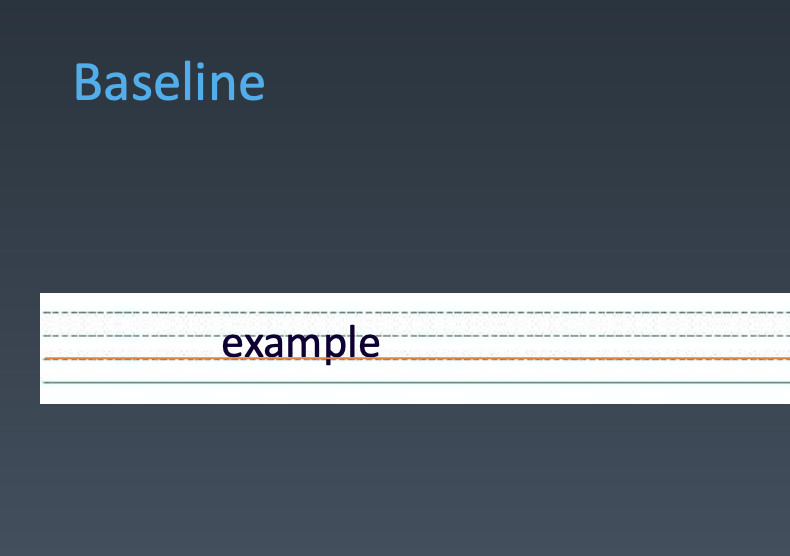
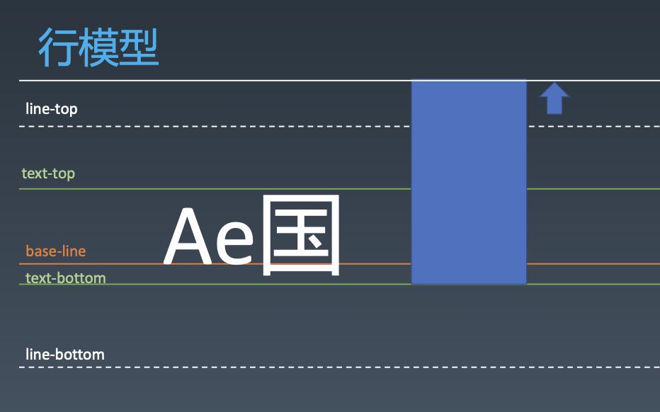
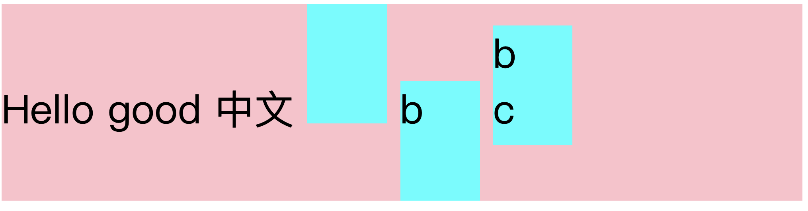
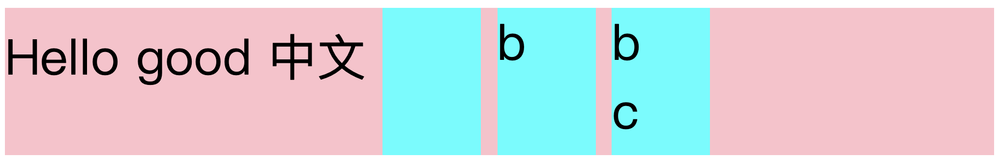
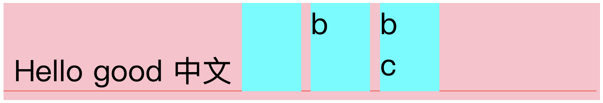

# 重学CSS
## CSS 排版
### 盒（Box）
* HTML代码中可以书写开始__标签__，结束__标签__ ，和自封闭__标签__ 。
* 一对起止__标签__ ，表示一个__元素__ 。
* DOM树中存储的是__元素__和其它类型的节点（Node）。
* CSS选择器选中的是__元素__ 。
* CSS选择器选中的__元素__ ，在排版时可能产生多个__盒__ 。
* 排版和渲染的基本单位是__盒__ 。
#### 盒模型


### 排版
> 其实就是计算 盒 和 文字 的位置

* 三代排版技术
    * 基于 正常流 的排版
        * 收集 盒 和 文字 进 行
        * 计算 盒 在行中的排布
        * 计算 行的排布
    * 基于 flex 技术的排版
    * 基于 grid 技术的排版

inline-level-box， 行内盒  
inline-box， 行盒  
block-level-box， 块级盒  
其实，排块级的就是 块级格式化上下文 - **BFC（block-level-formatting-context）**，排行盒的叫 行内级格式化上下文 - **IFC（inline-level-formatting-context）**

#### 正常流的行级排布
##### BaseLine - 基线对齐


##### 行模型
* baseline - 文字对齐 基线
* text-top - 文字 上缘
    * 字体大小不变，则不会变
    * 如果不同字体混排，取最大字体的值
* text-bottom - 文字 下缘
    * 字体大小不变，则不会变
    * 如果不同字体混排，取最大字体的值
* line-top - 行盒 上缘
    * 行高大于文字高度时有效
* line-bottom - 行盒 下缘
    * 行高大于文字高度时有效

###### 文字和行盒混排时，会存在line-top 和 line-bottom 偏移的问题
例如下图中，行内盒 text-bottom 对齐，存在将 line-top 从虚线的位置 撑开到实线的位置



###### 例子
1. 行内盒 与 文字对齐时
    * 有文字时，是根据行内盒内部文字的基线对齐的
    * 无文字时，是根据行内盒的底部对齐的
    * 因此文字和行内盒混用时，不建议使用 baseline，而是使用 `vertical-align:top`
```html
<div style="font-size:50px;line-height:100px;background-color:pink;">
    <span>Hello good 中文</span>
    <div style="line-height:70px;width:100px;height:150px;background-color:aqua;display:inline-block;"></div>
    <div style="line-height:70px;width:100px;height:150px;background-color:aqua;display:inline-block;">b</div>
    <div style="line-height:70px;width:100px;height:150px;background-color:aqua;display:inline-block;">b <br />c</div>
</div>
```


2. 行内盒 与 文字对齐时使用 `vertical-align:top`(或者是 bottom、middle)
    * 使用 top 时，与行盒顶部对齐，如果行内盒高度大于文字高度，则会底部撑开整行
    * 使用 bottom 时，与行盒顶部底齐，如果行内盒高度大于文字高度，则会顶部撑开整行
    * 可以同时被撑开
```html
<div style="font-size:50px;line-height:100px;background-color:pink;">
    <span>Hello good 中文</span>
    <div style="vertical-align:top;line-height:70px;width:100px;height:150px;background-color:aqua;display:inline-block;"></div>
    <div style="vertical-align:top;line-height:70px;width:100px;height:150px;background-color:aqua;display:inline-block;">b</div>
    <div style="vertical-align:top;line-height:70px;width:100px;height:150px;background-color:aqua;display:inline-block;">b <br />c</div>
</div>
```


3. 行内盒 与 文字对齐时使用 `vertical-align:text-bottom`(或者是 text-top)
    * 使用 text-top 时，与文字顶部对齐，如果行内盒高度大于文字高度，则会底部撑开整行
    * 使用 text-bottom 时，与文字底部对齐，如果行内盒高度大于文字高度，则会顶部撑开整行
    * 可以同时被撑开
```html
<div style="font-size:50px;line-height:100px;background-color:pink;">
    <span>Hello good 中文</span>
    <div style="vertical-align:text-bottom;line-height:70px;width:100px;height:150px;background-color:aqua;display:inline-block;"></div>
    <div style="vertical-align:text-bottom;line-height:70px;width:100px;height:150px;background-color:aqua;display:inline-block;">b</div>
    <div style="vertical-align:text-bottom;line-height:70px;width:100px;height:150px;background-color:aqua;display:inline-block;">b <br />c</div>
</div>
```


#### 正常流的块级排布
##### float 与 clear
现在前端布局，一般都可以使用 flex 代替 float 布局
##### Margin Collapse - 边界重叠


#### BFC（Block formatting context） 合并
##### Block
* Block Container - 里面能装 BFC 的盒
    * 能容正常流的盒，里面就有BFC
        * block
        * inline-block
        * table-cell
        * flex item
        * grid cell
        * table-caption 
* Block-level Box - 能放进 BFC 的盒
* Block Box = Block Container + Block-level Box - 里外都有 BFC

##### 设立 BFC
* floats
* absolutely positioned elements
* block containers (such as inline-blocks, table-cells, and table-captions) that are not block boxes,
    * flex items 
    * grid cell
* and block boxes with 'overflow' other than 'visible'
##### BFC 合并
* block box && overflow:visible 
    * BFC合并与float
    * BFC合并与边距折叠


#### Flex 排版
* 收集 盒 进 行
* 计算 盒 在主轴方向上的排布
* 计算 盒 在交叉轴方向上的排布

##### 分行
* 根据主轴尺寸，把元素分进行
* 若设置了no-wrap，则强行分配进第一行
#####  计算主轴方向
* 找出所有Flex元素
* 把主轴方向的剩余尺寸按比例分配给这些元素
* 若剩余空间为负数，所有flex元素为0，等比压缩剩余元素

##### 计算交叉轴方向
* 根据每一行中最大元素尺寸计算行高 
* 根据行高flex-align和item-align，确定元素具体位置


## CSS 动画
### Animation
* @keyframes - 定义
* animation - 使用

#### animation 
* animation-name 时间曲线
* animation-duration 动画的时长;
* animation-timing-function 动画的时间曲线; 
* animation-delay 动画开始前的延迟;
* animation-iteration-count 动画的播放次数; 
* animation-direction 动画的方向。


### Transition
* transition-property 要变换的属性;
* transition-duration 变换的时长;
* transition-timing-function 时间曲线; 
* transition-delay 延迟。

