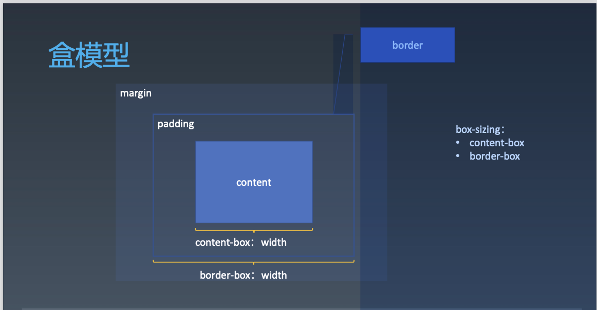

# 重学CSS
## CSS 排版
### 盒（Box）
* HTML代码中可以书写开始__标签__，结束__标签__ ，和自封闭__标签__ 。
* 一对起止__标签__ ，表示一个__元素__ 。
* DOM树中存储的是__元素__和其它类型的节点（Node）。
* CSS选择器选中的是__元素__ 。
* CSS选择器选中的__元素__ ，在排版时可能产生多个__盒__ 。
* 排版和渲染的基本单位是__盒__ 。
#### 盒模型

