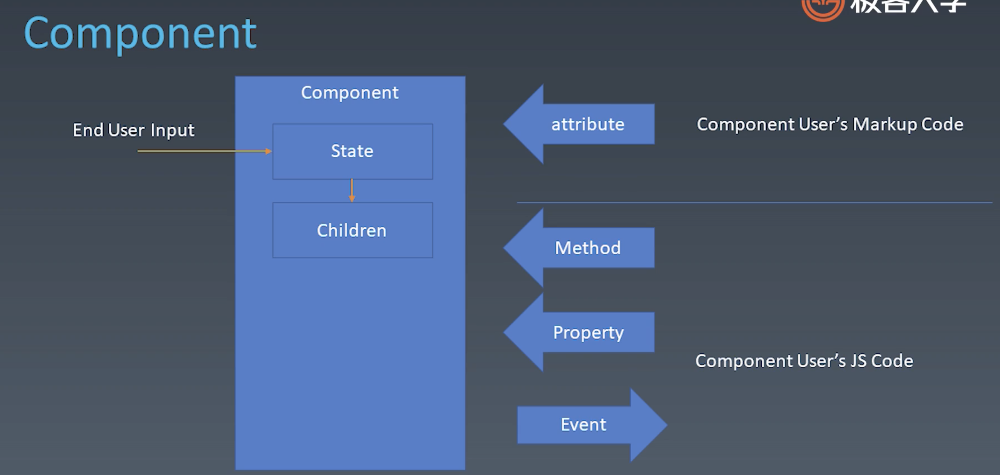
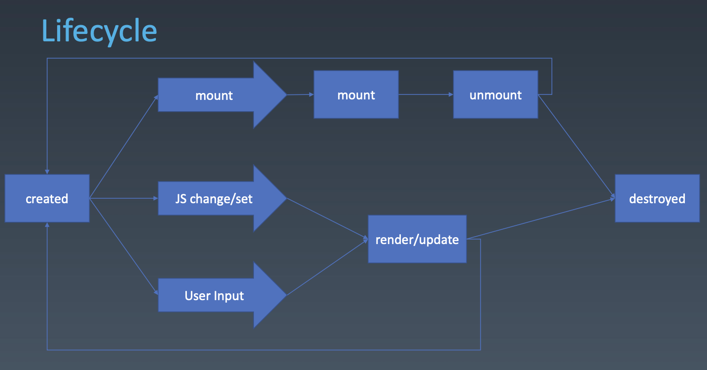

# 组件化
> 前端架构里最重要的一个部分，另一个重要组成部分是 架构模式  
> 最主要的目标是 复用  
> 架构模式是指 MVC、MVVC 等，最主要的目标是 解决前端和数据逻辑层之间如何交互问题  

## 组件的基本概念 和 基本组成部分
一般来说，我们认为组件是和 UI 强相关的一种东西   
它的特点是 可以以树形结构来进行组合，并且有一定的模板化的配置能力  

### 对象与组件
|对象|组件|说明
|:-:|:-:|:-:
|Properties|Properties|属性
|Methods|Methods|方法
|Inherit|Inherit|继承关系
||Attribute|属性 (主要是指类似标记语言 Markup Code)
||Config & State|可配置、状态
||Event|响应事件
||Lifecycle|生命周期
||Children|子组件



#### Attribute VS Properties
* 在英文中的区别：Attribute 强调描述性， Properties 强调从属关系
* HTML 是一个典型的 Attribute 和 Properties 不等效的系统
```jsx
// Attribute
<my-component attribute="v" />

myComponent.getAttribute('a')
myComponent.setAttribute('a', 'value')

// Properties
myComponent.a = 'value'
```

#### 如何设计组件状态
||Markup set|JS set|JS Change|User Input Change
|:-:|:-:|:-:|:-:|:-:
property|❎|✅|✅|❓
attribute|✅|✅|✅|❓
state|❎|❎|✅|✅
config|❎|✅|❎|❎

#### Lifecycle


#### Children
* Content 型 Children - 有多少显示多少
```jsx
    <my-button>{title}</my-button>
```
* Template 型 Children - 更具数据决定展示条数
```jsx
    <my-list>
        <li>{title}</li>
    </my-list>
```

### 为组件添加JSX语法
> 看 component 图可以发现，组件系统是由一个 Markup 和 JavaScript 代码两者都可以访问的一个环境

#### 两种 Markup 的建立风格
* JSX
* 基于标记语言的 parse

##### 配置 JSX 环境
```bash
# 1、安装 webpack webpack-cli
npm install -g webpack webpack-cli

# 2、安装 babel-loader （因为 JSX 需要 babel 插件 parse）
npm install --save-dev webpack babel-loader

# 3、安装 babel
npm install --save-dev @babel/core @babel/preset-env

# 4、安装 babel plugin
npm install --save-dev @babel/plugin-transform-react-jsx
```
